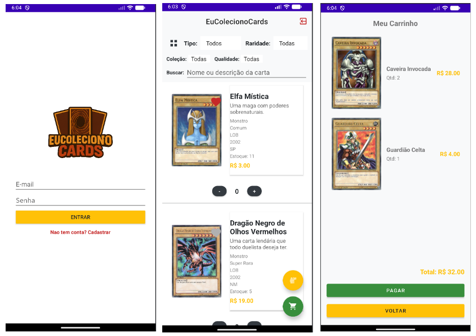

# EuColecionoCards Mobile (Android)

Projeto Android em Java inspirado no sistema EuColecionoCards.



## Pre-requisitos
- Android Studio (versao recente com suporte a AGP 8.13.2)
- JDK 17
- Android SDK instalado (compileSdk/targetSdk 34)
- Internet ativa para integrar com Supabase

## Telas implementadas
- `LoginActivity`
- `ProfileActivity`
- `CartasActivity`
- `CarrinhoActivity`
- `PagamentoActivity` (placeholder)

## Fluxo atual
1. Usuario abre o app em `LoginActivity`.
2. Se o perfil estiver incompleto, o app redireciona para `ProfileActivity`.
3. Com perfil completo, o app abre `CartasActivity`.
4. A partir de `CartasActivity`, o usuario acessa carrinho e pagamento placeholder.

## Como abrir no Android Studio
1. Abra o Android Studio.
2. Clique em **File > Open**.
3. Selecione a pasta `EuColecionoCardsMobile` e confirme.
4. Aguarde o Gradle Sync.
5. Execute em emulador ou dispositivo fisico.

## Configuracao do Supabase

O app le as configuracoes com esta prioridade:

1. Variaveis de ambiente
2. Propriedades Gradle
3. `local.properties`

Para desenvolvimento local, use o arquivo de exemplo:

```bash
cp local.properties.example local.properties
```

Depois, edite `local.properties`:

```properties
sdk.dir=/home/seu-usuario/Android/Sdk
SUPABASE_URL=https://seu-projeto.supabase.co
SUPABASE_ANON_KEY=sua_chave_anon_aqui
```

> Nao versione chaves reais em `gradle.properties` ou no repositorio.

## Supabase: tabelas e bucket

### 1) Criar tabelas (SQL Editor)
Execute no SQL Editor do Supabase:

```sql
create extension if not exists pgcrypto;

create table if not exists public.cards (
  id uuid primary key default gen_random_uuid(),
  code text not null unique,
  name text not null,
  description text,
  image_path text not null,
  type text not null,
  rarity text not null,
  collection text,
  year int,
  quality text,
  price numeric not null default 0,
  created_at timestamptz not null default now(),
  updated_at timestamptz not null default now(),
  stock_quantity int not null default 0
);

create table if not exists public.cart_items (
  user_id uuid not null references auth.users(id) on delete cascade,
  card_id uuid not null references public.cards(id) on delete cascade,
  quantity int not null check (quantity >= 0),
  updated_at timestamptz not null default now(),
  primary key (user_id, card_id)
);

create table if not exists public.profiles (
  id uuid primary key references auth.users(id) on delete cascade,
  display_name text,
  bio text,
  avatar_path text,
  created_at timestamptz not null default now(),
  updated_at timestamptz not null default now()
);

create table if not exists public.favorites (
  user_id uuid not null references auth.users(id) on delete cascade,
  card_id uuid not null references public.cards(id) on delete cascade,
  created_at timestamptz not null default now(),
  primary key (user_id, card_id)
);

create index if not exists idx_favorites_user_id on public.favorites(user_id);
create index if not exists idx_favorites_card_id on public.favorites(card_id);
```

### 2) Habilitar RLS e policies
```sql
alter table public.cards enable row level security;
alter table public.cart_items enable row level security;
alter table public.profiles enable row level security;
alter table public.favorites enable row level security;

drop policy if exists "cards_select_public" on public.cards;
create policy "cards_select_public"
on public.cards
for select
to public
using (true);

drop policy if exists "profiles_select_own" on public.profiles;
create policy "profiles_select_own"
on public.profiles
for select
to authenticated
using (id = auth.uid());

drop policy if exists "profiles_insert_own" on public.profiles;
create policy "profiles_insert_own"
on public.profiles
for insert
to authenticated
with check (id = auth.uid());

drop policy if exists "profiles_update_own" on public.profiles;
create policy "profiles_update_own"
on public.profiles
for update
to authenticated
using (id = auth.uid())
with check (id = auth.uid());

drop policy if exists "favorites_select_own" on public.favorites;
create policy "favorites_select_own"
on public.favorites
for select
to authenticated
using (user_id = auth.uid());

drop policy if exists "favorites_insert_own" on public.favorites;
create policy "favorites_insert_own"
on public.favorites
for insert
to authenticated
with check (user_id = auth.uid());

drop policy if exists "favorites_delete_own" on public.favorites;
create policy "favorites_delete_own"
on public.favorites
for delete
to authenticated
using (user_id = auth.uid());

drop policy if exists "cart_items_select_own" on public.cart_items;
create policy "cart_items_select_own"
on public.cart_items
for select
to authenticated
using (user_id = auth.uid());

drop policy if exists "cart_items_insert_own" on public.cart_items;
create policy "cart_items_insert_own"
on public.cart_items
for insert
to authenticated
with check (user_id = auth.uid());

drop policy if exists "cart_items_update_own" on public.cart_items;
create policy "cart_items_update_own"
on public.cart_items
for update
to authenticated
using (user_id = auth.uid())
with check (user_id = auth.uid());

drop policy if exists "cart_items_delete_own" on public.cart_items;
create policy "cart_items_delete_own"
on public.cart_items
for delete
to authenticated
using (user_id = auth.uid());
```

### 3) Criar bucket usado pelo app (`card-images`)
```sql
insert into storage.buckets (id, name, public)
values ('card-images', 'card-images', true)
on conflict (id) do nothing;

drop policy if exists "card_images_public_read" on storage.objects;
create policy "card_images_public_read"
on storage.objects
for select
to public
using (bucket_id = 'card-images');
```

### 4) Imagens de Teste

- No bucket `card-images`, suba as imagens presentes na pasta Cartas em docs.

### 5) Popular a tabela `cards`

> **Sobre o `id`:** o campo é `uuid DEFAULT gen_random_uuid()`, mas esse default só é usado quando o `id` é **omitido** no INSERT.
> Passando o valor explicitamente (como abaixo), o banco usa o UUID fornecido sem conflito com a geração automática.
> Para rodar os inserts de forma segura **mais de uma vez** (idempotente), adicione `ON CONFLICT (id) DO NOTHING` ao final de cada linha.

Cole no SQL Editor do Supabase:

```

| insert_sql                                                                                                                                                                                                                                                                                                                                                                                                                                               |
| -------------------------------------------------------------------------------------------------------------------------------------------------------------------------------------------------------------------------------------------------------------------------------------------------------------------------------------------------------------------------------------------------------------------------------------------------------- |
| insert into public.cards (id, code, name, description, image_path, type, rarity, collection, year, quality, price, created_at, updated_at, stock_quantity) values ('7ca1408f-8628-41b4-b4f8-6ec321386b6c', 'card1', 'Dragão Branco de Olhos Azuis', 'Um dos monstros mais icônicos do jogo. Edição rara.', 'card1.webp', 'Monstro', 'Ultra Rara', 'LOB', '2002', 'NM', '100.00', '2026-04-01 00:59:20.691212+00', '2026-04-01 05:58:03.639221+00', '3'); |
| insert into public.cards (id, code, name, description, image_path, type, rarity, collection, year, quality, price, created_at, updated_at, stock_quantity) values ('d9565423-02de-4b91-bf7e-86537cca193d', 'card10', 'Blader Notável', 'Especialista em derrotar dragões.', 'card10.webp', 'Monstro', 'Comum', 'IOC', '2004', 'PL', '1.00', '2026-04-01 00:59:20.691212+00', '2026-04-01 05:58:03.639221+00', '9');                                      |
| insert into public.cards (id, code, name, description, image_path, type, rarity, collection, year, quality, price, created_at, updated_at, stock_quantity) values ('de9d011e-47d9-4b32-a1ef-5863cbbebad1', 'card11', 'Dragão Filhote', 'Pequeno mas poderoso!', 'card11.webp', 'Monstro', 'Rara', 'LOB', '2002', 'HP', '15.00', '2026-04-01 00:59:20.691212+00', '2026-04-01 05:58:03.639221+00', '7');                                                  |
| insert into public.cards (id, code, name, description, image_path, type, rarity, collection, year, quality, price, created_at, updated_at, stock_quantity) values ('f40ce1c2-5d5f-48bc-8686-e6b4674a3685', 'card12', 'Jinzo', 'Neutraliza armadilhas e domina o campo.', 'card12.webp', 'Monstro', 'Ultra Rara', 'PSV', '2002', 'NM', '6.00', '2026-04-01 00:59:20.691212+00', '2026-04-01 05:58:03.639221+00', '10');                                   |
| insert into public.cards (id, code, name, description, image_path, type, rarity, collection, year, quality, price, created_at, updated_at, stock_quantity) values ('944701be-571b-44d9-bf59-17f2a03e1126', 'card13', 'Saggi, o Palhaço Sombrio', 'Um palhaço sombrio e ágil.', 'card13.webp', 'Monstro', 'Comum', 'LOB', '2002', 'SP', '0.90', '2026-04-01 00:59:20.691212+00', '2026-04-01 05:58:03.639221+00', '2');                                   |
| insert into public.cards (id, code, name, description, image_path, type, rarity, collection, year, quality, price, created_at, updated_at, stock_quantity) values ('ce97d98f-039d-40d9-b783-6a3ee4c03652', 'card14', 'Kuriboh', 'Pequeno, mas com um papel defensivo importante.', 'card14.webp', 'Monstro', 'Rara', 'MRD', '2002', 'DM', '2.75', '2026-04-01 00:59:20.691212+00', '2026-04-01 05:58:03.639221+00', '11');                               |
| insert into public.cards (id, code, name, description, image_path, type, rarity, collection, year, quality, price, created_at, updated_at, stock_quantity) values ('834f9a78-c4a0-492f-92a7-00e87a852165', 'card15', 'Neos, o HERÓI do Elemento', 'Protagonista da era GX. Forte e versátil.', 'card15.webp', 'Monstro', 'Ultra Rara', 'STON', '2007', 'NM', '7.00', '2026-04-01 00:59:20.691212+00', '2026-04-01 05:58:03.639221+00', '5');             |
| insert into public.cards (id, code, name, description, image_path, type, rarity, collection, year, quality, price, created_at, updated_at, stock_quantity) values ('aaf3e401-28d4-45b2-9fa0-8537aa086aa6', 'card16', 'Gaia, o Cavaleiro Impetuoso', 'Montado em um cavalo negro, rápido e feroz.', 'card16.webp', 'Monstro', 'Rara', 'LOB', '2002', 'PL', '3.00', '2026-04-01 00:59:20.691212+00', '2026-04-01 05:58:03.639221+00', '3');                |
| insert into public.cards (id, code, name, description, image_path, type, rarity, collection, year, quality, price, created_at, updated_at, stock_quantity) values ('af5de344-a498-46b6-bf9a-874b77d665dd', 'card17', 'Soldado do Lustro Negro', 'Carta ritual poderosa e icônica do Yugi.', 'card17.webp', 'Monstro', 'Ultra Rara', 'LOB', '2002', 'NM', '9.00', '2026-04-01 00:59:20.691212+00', '2026-04-01 05:58:03.639221+00', '8');                 |
| insert into public.cards (id, code, name, description, image_path, type, rarity, collection, year, quality, price, created_at, updated_at, stock_quantity) values ('1e12dd82-c12f-408b-b444-136292ec7137', 'card18', 'Mago do Tempo', 'Pode mudar o rumo do duelo com sorte.', 'card18.webp', 'Monstro', 'Super Rara', 'MRD', '2002', 'SP', '30.00', '2026-04-01 00:59:20.691212+00', '2026-04-01 05:58:03.639221+00', '12');                            |
| insert into public.cards (id, code, name, description, image_path, type, rarity, collection, year, quality, price, created_at, updated_at, stock_quantity) values ('9537402a-b61e-4d8f-9db2-73ee3fa3a4d7', 'card19', 'Dragão Milenar', 'Fusão do Dragão Filhote com o Mago do Tempo.', 'card19.webp', 'Monstro', 'Rara', 'MRD', '2002', 'HP', '0.50', '2026-04-01 00:59:20.691212+00', '2026-04-01 05:58:03.639221+00', '1');                            |
| insert into public.cards (id, code, name, description, image_path, type, rarity, collection, year, quality, price, created_at, updated_at, stock_quantity) values ('584a414f-4915-44fe-be74-3849b33976d5', 'card2', 'Elfa Mística', 'Uma maga com poderes sobrenaturais.', 'card2.webp', 'Monstro', 'Comum', 'LOB', '2002', 'SP', '3.00', '2026-04-01 00:59:20.691212+00', '2026-04-01 05:58:03.639221+00', '11');                                       |
| insert into public.cards (id, code, name, description, image_path, type, rarity, collection, year, quality, price, created_at, updated_at, stock_quantity) values ('a7df1a3c-f1f5-4068-ba5a-73729d3f49e1', 'card20', 'Força do Espelho', 'Uma armadilha que vira o jogo contra o oponente.', 'card20.webp', 'Armadilha', 'Ultra Rara', 'MRD', '2002', 'NM', '10.00', '2026-04-01 00:59:20.691212+00', '2026-04-01 05:58:03.639221+00', '6');             |
| insert into public.cards (id, code, name, description, image_path, type, rarity, collection, year, quality, price, created_at, updated_at, stock_quantity) values ('d69af02a-6de0-4215-8d72-e509d4b22262', 'card21', 'Reviver Monstro', 'Revive qualquer monstro do cemitério.', 'card21.webp', 'Mágica', 'Ultra Rara', 'LOB', '2002', 'NM', '45.00', '2026-04-01 00:59:20.691212+00', '2026-04-01 05:58:03.639221+00', '4');                            |
| insert into public.cards (id, code, name, description, image_path, type, rarity, collection, year, quality, price, created_at, updated_at, stock_quantity) values ('9a185a09-54cf-4d52-88b2-c5411677e0d7', 'card22', 'Espadas da Luz Reveladora', 'Impede ataques do oponente por 3 turnos.', 'card22.webp', 'Mágica', 'Super Rara', 'LOB', '2002', 'SP', '5.00', '2026-04-01 00:59:20.691212+00', '2026-04-01 05:58:03.639221+00', '9');                |
| insert into public.cards (id, code, name, description, image_path, type, rarity, collection, year, quality, price, created_at, updated_at, stock_quantity) values ('5a35dec9-30d2-4576-bfd2-4fe7cec7382a', 'card23', 'Mudança de Opinião', 'Controle o monstro do oponente por um turno.', 'card23.webp', 'Mágica', 'Rara', 'LOB', '2002', 'PL', '2.90', '2026-04-01 00:59:20.691212+00', '2026-04-01 05:58:03.639221+00', '7');                         |
| insert into public.cards (id, code, name, description, image_path, type, rarity, collection, year, quality, price, created_at, updated_at, stock_quantity) values ('3a17296f-3b8f-40ef-8e8c-5448d34b73d6', 'card24', 'Pote da Ganância', 'Compre duas cartas sem custo!', 'card24.webp', 'Mágica', 'Super Rara', 'LOB', '2002', 'NM', '3.50', '2026-04-01 00:59:20.691212+00', '2026-04-01 05:58:03.639221+00', '10');                                   |
| insert into public.cards (id, code, name, description, image_path, type, rarity, collection, year, quality, price, created_at, updated_at, stock_quantity) values ('e508f6b7-df9b-463b-8a7c-a335f454d064', 'card3', 'Dragão Negro de Olhos Vermelhos', 'Uma carta lendária que todo duelista deseja ter.', 'card3.webp', 'Monstro', 'Super Rara', 'LOB', '2002', 'NM', '19.00', '2026-04-01 00:59:20.691212+00', '2026-04-01 05:58:03.639221+00', '5');  |
| insert into public.cards (id, code, name, description, image_path, type, rarity, collection, year, quality, price, created_at, updated_at, stock_quantity) values ('661d781c-c35b-4c9d-8f1e-3e916ffd330f', 'card4', 'Caveira Invocada', 'Um monstro forte com ataque poderoso.', 'card4.webp', 'Monstro', 'Rara', 'MRD', '2002', 'PL', '14.00', '2026-04-01 00:59:20.691212+00', '2026-04-01 05:58:03.639221+00', '2');                                  |
| insert into public.cards (id, code, name, description, image_path, type, rarity, collection, year, quality, price, created_at, updated_at, stock_quantity) values ('a0e12b1e-985e-42ab-9191-55a4f62b989b', 'card5', 'Guardião Celta', 'Um elfo pronto para a luta!', 'card5.webp', 'Monstro', 'Comum', 'LOB', '2002', 'HP', '4.00', '2026-04-01 00:59:20.691212+00', '2026-04-01 05:58:03.639221+00', '8');                                              |
| insert into public.cards (id, code, name, description, image_path, type, rarity, collection, year, quality, price, created_at, updated_at, stock_quantity) values ('36569642-f5b4-46eb-837e-99d5d48dbc38', 'card6', 'Obelisco, o Atormentador', 'Um dos Deuses Egípcios. Destruição total.', 'card6.webp', 'Monstro', 'Ultra Rara', 'GBI', '2004', 'NM', '5.90', '2026-04-01 00:59:20.691212+00', '2026-04-01 05:58:03.639221+00', '1');                 |
| insert into public.cards (id, code, name, description, image_path, type, rarity, collection, year, quality, price, created_at, updated_at, stock_quantity) values ('4cbe13e3-39b2-4422-994b-cc0d961ef892', 'card7', 'Slifer, o Dragão Celeste', 'Poder aumenta conforme suas cartas na mão.', 'card7.webp', 'Monstro', 'Ultra Rara', 'GBI', '2004', 'SP', '12.50', '2026-04-01 00:59:20.691212+00', '2026-04-01 05:58:03.639221+00', '12');              |
| insert into public.cards (id, code, name, description, image_path, type, rarity, collection, year, quality, price, created_at, updated_at, stock_quantity) values ('17f8d155-e17e-4d88-b328-3358ef0f83be', 'card8', 'O Dragão Alado de Rá', 'O mais misterioso dos Deuses Egípcios.', 'card8.webp', 'Monstro', 'Ultra Rara', 'GBI', '2004', 'NM', '16.00', '2026-04-01 00:59:20.691212+00', '2026-04-01 05:58:03.639221+00', '6');                       |
| insert into public.cards (id, code, name, description, image_path, type, rarity, collection, year, quality, price, created_at, updated_at, stock_quantity) values ('cd304ee5-7f07-4db5-b8c1-9e54491cf0fa', 'card9', 'Pequena Maga Negra', 'Aprendiz do Mago Negro, muito querida pelos fãs.', 'card9.webp', 'Monstro', 'Super Rara', 'MFC', '2003', 'NM', '25.00', '2026-04-01 00:59:20.691212+00', '2026-04-01 05:58:03.639221+00', '4');               |
```

## Build e validacao do projeto
```bash
./gradlew :app:assembleDebug
```

## Seguranca de senha
- A validacao atual no login exige senha com no minimo 10 caracteres.
- Para maior seguranca, recomenda-se reforcar a politica no cliente e no Supabase Auth.


